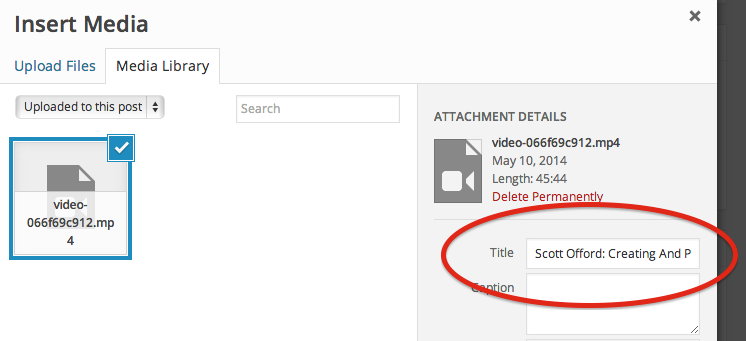

# Approving Videos

Welcome to wordpress.tv! Moderating content here is a fairly simple process. However, wordpress.tv has a few custom features you’ll need to familiarize yourself with and there are some manual tasks that you will need to perform to moderate video content.

The following video and text instructions cover some basic guidelines for moderating a video (WordCamp, meetup, tutorial, etc.) on wordpress.tv. There are also several related manual pages that explain our procedures in-depth and provide background on any edge cases you may run across when reviewing videos.

## Text Instructions

### Step 1 – Go to Posts→All Posts→Pending

To locate videos in need of moderation, log in to [wptv.wordpress.com](https://wptv.wordpress.com/wp-admin) and go to Posts→All Posts. Videos to be moderated are in the pending queue; click on Pending to see the videos that need moderating.

### Step 2 – Locate a video to moderate

Any video in the pending queue that has WordPress.tv as the author is available for moderation. If a video has someone’s name in the author field, then this video has already been selected for moderation by that person.

You will also notice that all recent uploads (from the video submitter) will show Uploaded Video in the Title field.  In some cases, another moderator may go through and save the titles to these videos to make it easier to see what the video is about.  Click “Edit” to choose one that you want to moderate.

### Step 3 – Review the video

Moderating the video itself primarily means watching for the following things:

* Can you hear the speaker clearly?
* Can you see the speaker and the presentation? (If there is not a visable presentation, is there a link to slides?)
* Is the content of the talk factually accurate?
* Is there anything that violates GPL/community guidelines?

Your goals while moderating the video are to watch for appropriate content and to make sure the video is usable. You can use the WordCamp submission guidelines for help. If you have a difficult time viewing or hearing the presentation, then it is likely others will not find viewing the video to be a useful experience either.

If there is a problem with the video then use the tag field to mark the issue. `NEEDS SLIDES`, `POOR AUDIO` or `POOR VIDEO` for instance. If the video is appropriate to publish, put `READY TO PUBLISH` in the tag field. This lets a lead moderator know to review the video for publication.

**Note:** Tags that you see associated with videos that are in [`[ALL CAPS]`](https://make.wordpress.org/tv/handbook/approving-videos/communication/moderator-tags/) are considered to be `MOD TAGS` and are what we use to communicate to other mods regarding issues with certain videos. Feel free to add your own, and make sure to remove any [`[MOD TAGS]`](https://make.wordpress.org/tv/handbook/approving-videos/communication/moderator-tags/) you see before scheduling a video for publication.

### Step 4 – Edit/approve the supplied video info

There are two methods for submitting videos to WPTV.  Videos are uploaded using the [public submission](http://wordpress.tv/submit-video/) form on WordPress.tv or they are [uploaded manually](https://make.wordpress.org/tv/handbook/approving-videos/approving-manual-submissions/) using the Media Uploader, which attaches the video to a newly created post. Each of these methods produces a different edit screen.

If the submit form was used, then you will find information that was entered by the submitter when the video was uploaded directly under the video preview. In most cases this information is accurate, but you check it for accuracy as well as edit the format for consistency. Pay particular attention to the “Event” field since this field impacts search results.

Once you have checked each field, click on the “Approve” button next to that field. This will place the submitter information into the related modules in the post editor. Once the “Approve” button has been clicked, the information in these text fields cannot be edited again (you’ll notice that the “Approve” button will be greyed-out). If you need to make any edits to this information after clicking the “Approve” button then you will need to make those edits in the related module field since any edit in a greyed-out “Approve” field will not be passed on to the modules.

Where submitter info is mapped in the post editor:

|Submitted Info|Post Meta|
|---------|----------------|
|Title|Post Title (and permalink)|
|Language|Language sidebar meta|
|Categories|Categories sidebar meta|
|Event|Event sidebar meta|
|Producer|NOT USED|
|Speakers|Speakers sidebar meta|
|Description|Post excerpt|
|Slides|Video Info meta|

>**Note:** Once you have clicked the “Submit” button, you cannot edit the text in the submitter fields (You will see the submit button is greyed-out) in which case you will need to find the associated post meta box, as shown in the table above.

### Step 5 – Format the post title and attachment title

>**Note:** This step seems no longer needed. The title of the post is set as title of the attachment upon doing an ‘Update’ or ‘Publish’. To be double-checked, then we can delete this step.

In most cases, the post title needs to be formatted to include the speaker name along with the title of the presentation. WordCamp videos on WordPress.tv use the following format for titling videos:

`Speaker Name: Title of the WordCamp Presentation`

Once the post title is formatted, copy this information as you will need it to change the video name to a user friendly format. To update the video name, click the “Add Media” button, and in the Media Library drop-down select the “Uploaded to this Post” option to show the video file associated with the post.

From here, click on the icon for the video file, and in the Attachment Details area in the sidebar, click on the Title field and paste in the post title as formatted above. When you are done, you can click the **X** in the upper right corner to exit the media manager.

>**Note:** There is no need to click the Insert into Post button to save your changes; the media title is saved automatically when you edit it in the step above.

### Step 6 – Approve/add categories and tags

Categories are not displayed on the front end of wordpress.tv, but are mainly used by the theme to categorize content. For WordCamp videos, there are a few that are essential, such as:

* Year of the event
* Event City
* WordCampTV (usually already selected)

If the submitter has already provided any of these categories in the main info window, you can approve them by clicking on each one that applies. For any other categories you want to add, use the “Categories” meta box to select them. There are quite a few categories listed, so it is easier to start at the bottom, where you’ll find a few of the common WordCamp related ones.

Once you’ve chosen the categories that are appropriate for the video, you can add tags, though you may want to moderate the video before entering these. Tags are displayed on the front end of the site, next to the video, so these can help visitors to find related videos. Feel free to add any you think apply.

Sometimes the submitter has selected some categories that are better suited for use as tags. Remember that categories do not display on the front end of wordpress.tv, so you will want to add these as tags instead of approving them as categories.

### Step 7 – Edit the video description and add slides

Now you can edit the description. Usually this is written in the future tense since it was written for a talk that hadn’t yet happened. Edit the description and change it to past tense so that it is easier to read. If the description is long, feel free to shorten it. Longer descriptions may not be read anyway. If the submitter did not provide a description, please try to find one from the WordCamp website if possible.

Slides are also an important part of the video description. Often the uploader has supplied a link to the speaker’s slides. If no links to slides were provided, sometimes the presenter will give the location of the slides during the talk. If this is the case, please verify that there are slides at this location before attaching this information to the post.

If you have a URL for the location of the slides, paste the URL into the slides URL field located in the Video Info meta section, which is just below the Edit Screen.

>**Note:** Good descriptions and links to slides are both important to providing useful videos on wordpress.tv. If you don’t have either of these items, please ping your lead moderator in Slack so we can try to contact the WordCamp organizer/presenter. We will sometimes publish a video without these elements, but we make every effort to include them wherever possible.

### Step 8 – Select a video thumbnail

Now all that remains is selecting a thumbnail. You’ll need to play the video in order to select a thumbnail. Videos can be played from the Edit Post screen if the submit form was used or, if the Media Uploader was used, they can be moderated by clicking the Add Media button as described in Step 2.

When you play a video, you’ll notice that a capture thumbnail icon will appear when you hover over the video. Click this icon to select the frame to use for the thumbnail or stop the video and click the icon to select a precise frame.

### Step 9 – Finalize for publication

When you are done, you can click the Preview button to see if everything is correct. Hover over the video to see the name and click the slides link to make sure it works and goes to the proper slides.

If everything looks good, Add the [`[READY TO PUBLISH]`](https://make.wordpress.org/tv/handbook/approving-videos/communication/moderator-tags/%20%E2%80%8E)) tag to the video, to alert the lead mod that this video is ready, and then you can click the Save As Pending button to save all your changes. Do not click the Publish button at any time. A lead moderator will review the video later and schedule it for publication it then.

## Video Tutorial

[Click here to see: Video Tutorial](https://videopress.com/v/17AccN9i
)

