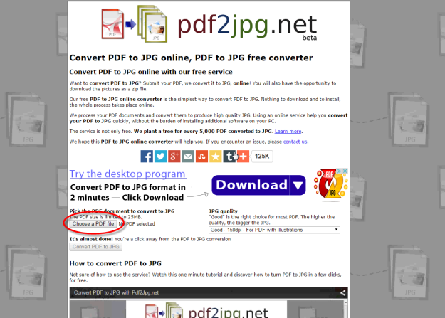
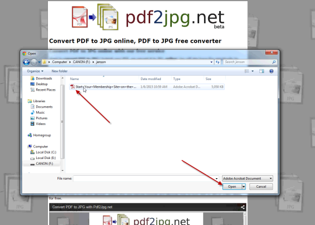
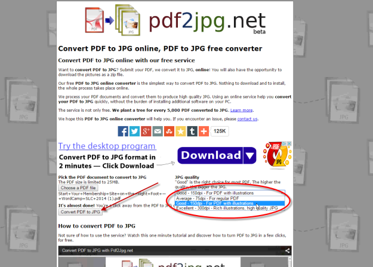
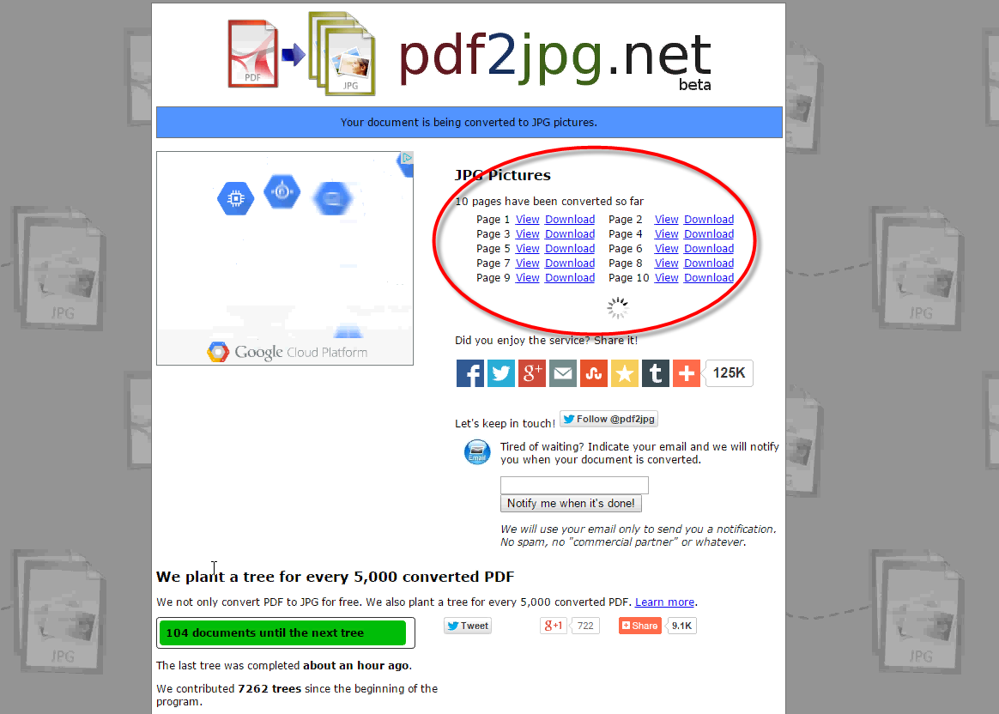
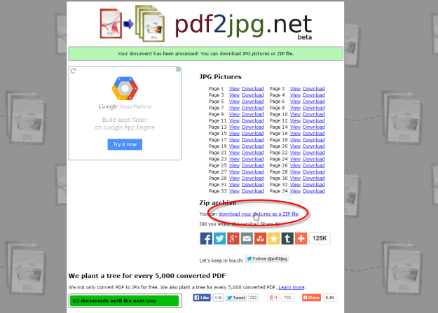
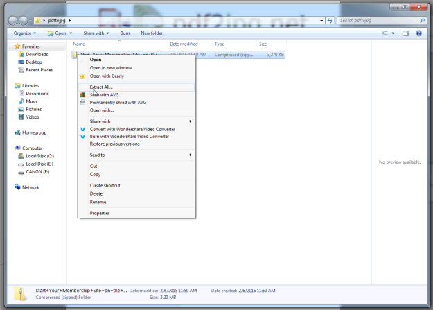
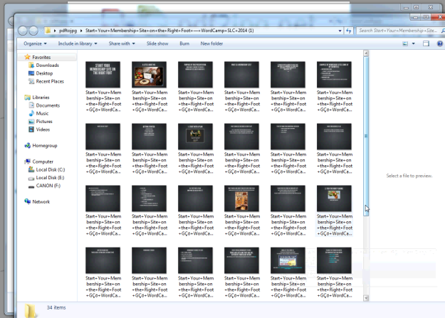
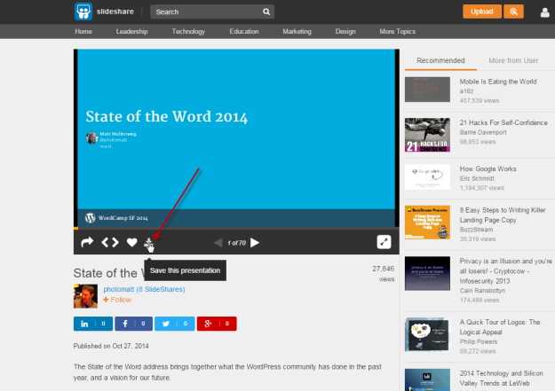

# Converting Slides

Presentation slides sometimes need to be added to a video. In order to add slides, each slide needs to be available as a single file. If individual slide files are not provided, then they will need to be created from a PDF file or from a slide presentation service. Some PDF files will be supplied with the video but others can be downloaded from Slideshare or Speakerdeck.

PDF files can be converted to jpegs for free at this site. This process converts a PDF to a .zip file with individual slides that can be downloaded.

On the converter site page click the “Choose a PDF file” button.

Select a PDF file from your computer and click “Open.”

Leave the JPG quality set at “Good – 150 DPI” and click the “Convert PDF to JPG” button.

This starts the conversion process.

When the process finishes, download the ZIP file by clicking the “download your pictures as a zip” link.

Now you can extract the zip file

and move the jpgs to your work folder.

Sometimes the PDF file is not available. You can find some of the presentation slides on slideshare.net or speakerdeck.com and a PDF of the file can be downloaded by clicking the “Save this presentation” button.

