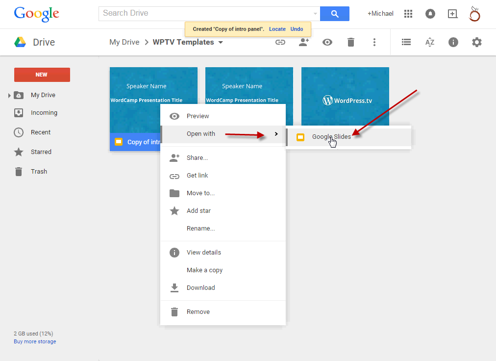
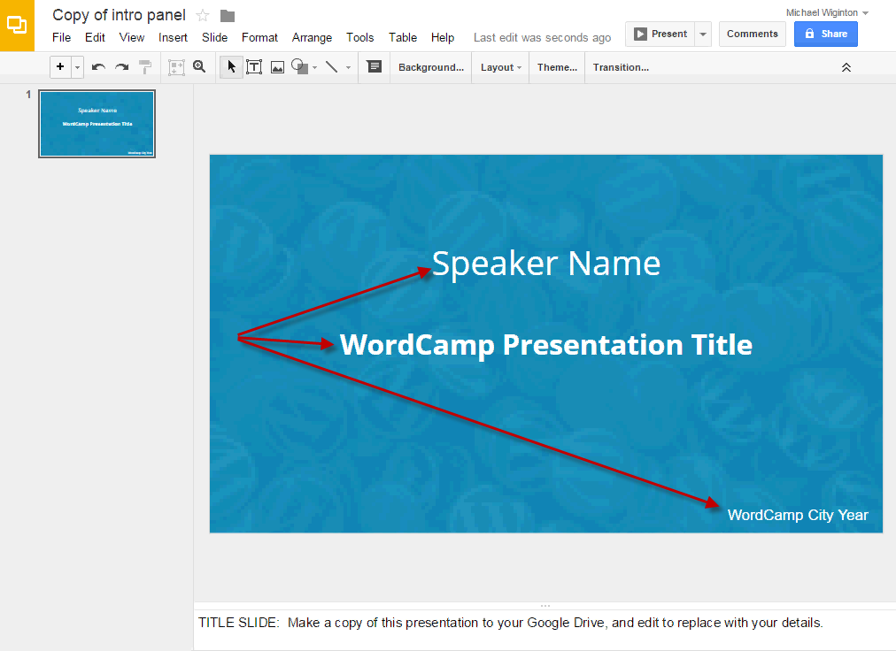
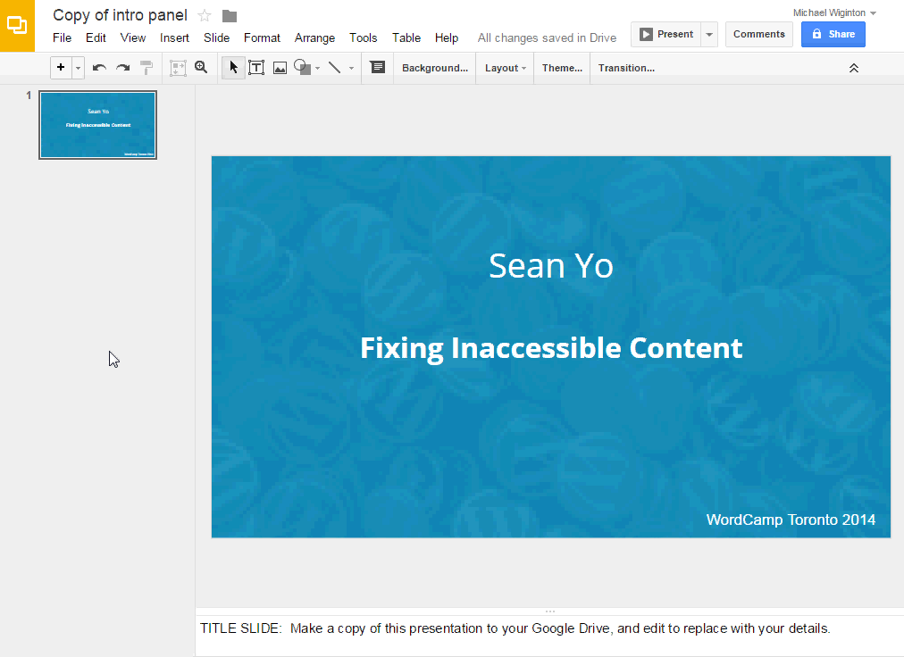
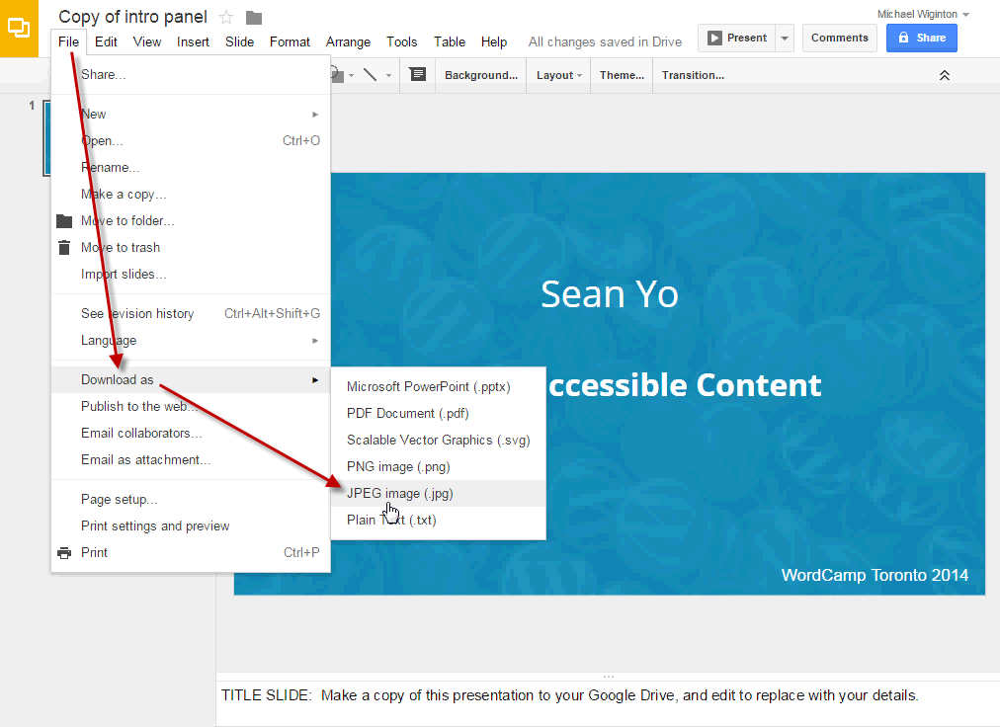
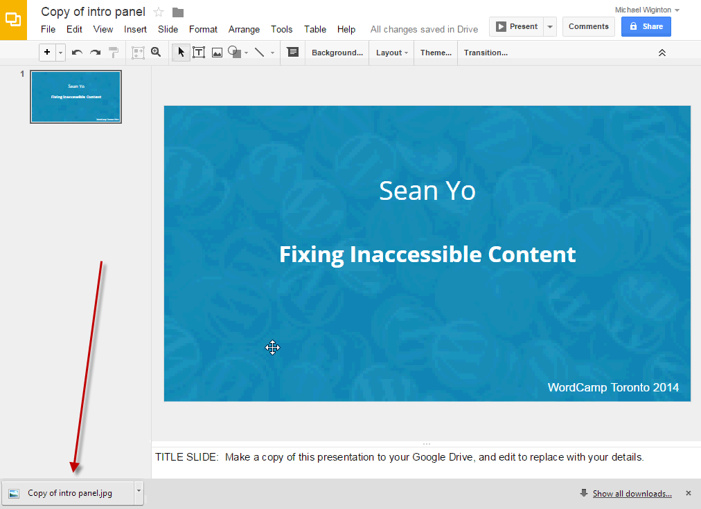

# Making Intro and Outro Panels

Intro and Outro panels are added to all videos.

[Click to access Intro Panel template.](https://docs.google.com/presentation/d/16yHQOfGFgH9hGbyx1DcpNITOA5Vjrm9gV3NaU9_rgpU/edit?usp=sharing)

To edit this file make a copy by hovering over the panel and right clicking the mouse and selecting the Make A Copy option.

Now open the copy in Google Slides by hovering the mouse over the panel and right clicking and selecting Open With and Google Slides.

The speaker first and last name, the title of the presentation and the WordCamp information needs to be added.

Click on each to change the information.

Now download the completed panel by clicking File on the menu bar and selecting Download as and JPEG image (.jpg).

Now move the downloaded file to your work folder.

The Outro panel can be downloaded and used as-is. Right Click on the image below and Save the image to your work folder.
