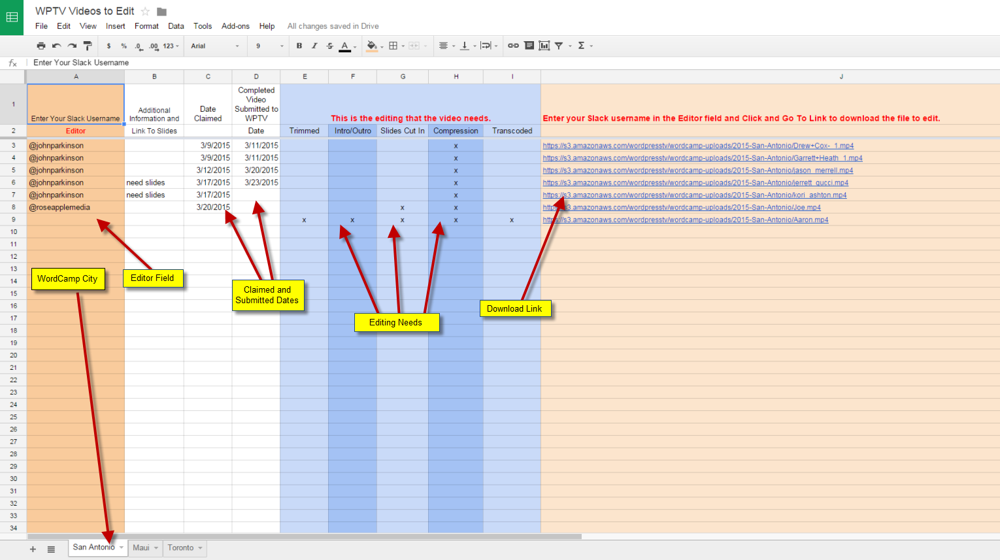

# Selecting a Video to Edit

## SELECT A VIDEO:

Videos that need processing or editing can be found at [WPTV Videos to Edit](https://docs.google.com/spreadsheets/d/16y7U6icEeexSbifVj7eIuApiHQ5CqyDMAVKxyyujycA/edit).

Videos are grouped by the WordCamp city. At the bottom of the spreadsheet select the WordCamp you want to work in and click the city.

Videos can be in different stages of processing and can be in different formats. Some need compression only while others will need much more.

Videos are claimed for processing by entering your Slack username or contact email in the Editor field and filling in the Date Claimed field. Any video that has not been claimed can be downloaded for processing. Click on the video link and the download will start.

The processing or editing needed for a video is indicated in the blue columns. The editing needs in these columns may not be all the videos needs. If you find it needs more editing than indicated on the sheet and you cannot complete those edits then you can delete your name in the spreadsheet so it can be reclaimed. Please enter the additional editing needed in the Additional Information field in the spreadsheet.

After the processing or editing has been complete then the video can be submitted to [WPTV at Submit Video](http://wordpress.tv/submit-video/) To WPTV

Remember to enter the Date Submitted in the spreadsheet.

Any good editing software can be used for processing videos.

Open Source software (free to download, free to use) is available and can be used for any of these processes.
Also instructions for performing any of these editing tasks is also available.

You can use the software you like, but if you need some help in finding one we can recommend these software, they are all free and open source.

## Shotcut

Shotcut is the first we recommend, it has official support for all the main operating systems (Linux, Windows and MacOS, it’s updated regularly and it’s the one we chose to write [our guide](https://make.wordpress.org/tv/handbook/video-editing/video-editor/).

You can find more info and the download page on the [Shotcut official website](https://shotcut.org/).

## Kdenlive

Kdenlive is also easy to use, free and open source. It’s more powerful than Shotcut, it has many addons and functions and it is much appreciated in particular in the Linux community, but it lacks an official build for MacOS, so we can recommend it only if you are on a Linux or Windows system.

More info on the [Kdenlive official website](https://kdenlive.org/).

## OpenShot
OpenShot is as easy to use as Shotcut as well as free and open source and it has official support for Linux, Windows and MacOS. The only concern is that [they use Google Analytics for bug and crash tracking](https://github.com/OpenShot/openshot-qt/issues/877). Nothing to worry about, the team is using it as a tool to improve their software, but for someone it may be a concern for privacy reasons.

More info on the [OpenShot official website](https://www.openshot.org/).

In the next step you can find a guide on [how to use Shotcut for editing videos](https://make.wordpress.org/tv/handbook/video-editing/video-editor/).