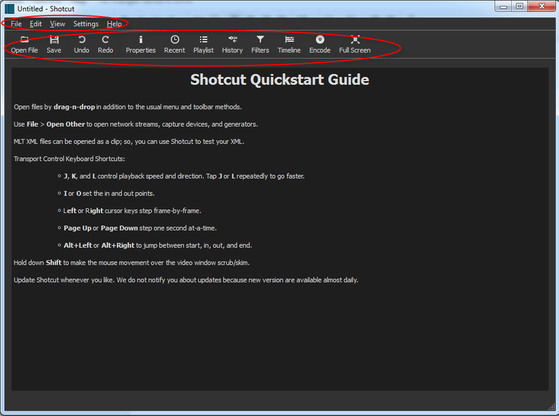

# Editing Video with Shotcut (open source)

Shotcut video editing software can be used to trim videos, add intro and outro panles, to cut the slides into the presentations and for encoding.

Here’s a video tutorial on how to edit videos using Shotcut, followed by a written guide.

Shotcut is a basic open-source cross-platform non-linear video editor that is free to download and free to use. Download this editor at the Shotcut site.

[Video](https://videopress.com/embed/OktT3yju)

## Setting the Editor Layout

The default layout for Shotcut is a preview screen with a toolbar and a navigation menu.

Different panels can be opened to fit your needs and screen. Settings that we will be using are the Playlist, Properties, Timeline, Encode and Jobs. These can be added to the Shotcut screen.

Click the View menu item and select Playlist – Properties – Encode – Timeline – Job.

You will then have a panel with the Playlist, Properties and Encode tabs shown at the bottom. And the Jobs panel to the right and the Timeline panel at the bottom. Giving you a screen like the one below.

The size of each of these panels can be adjusted to fit your screen or personal preferences.

## Video Editor Settings

Most of the settings can be left at the default. The one exception is the default time settings for a image file. This setting should be set before any images are imported.

To set this default time select Open File and select an image file and click open. Click on the Properties tab at the bottom of the panel to the far left. This Properties tab is where the default time can be set. Set his default time to 5 seconds (or anytime time length you feel is appropriate) and click the Set Default for the Duration.

shotcutDuratioinDefault

Now whenever you import images the duration will be set to this time.

Adding a video to edit can be done by selecting Open File and choosing the video and click Open. If you have the video, the intro and outro and the slides in the same folder you can simply add them all at the same time.

shotcutAddVideo

You now have all the files you need to start editing the video in the Playlist panel.

To start the edit you will need to drag a file to the timeline which is located under the preview screen. Simply drag-and-drop a file and a timeline will be created. Shotcut uses the metadata from the first file to use for the project, so the first file you put on the timeline should be the actual video you want to edit.

shotcutDragVideo

Shotcut will place the playhead at the end of the video when it is dragged-and-dropped. To set the playhead to the beginning of the video click on the scrubber and hold the mouse down and drag it to the beginning. Now click the timeline to place the playhead.

Top ↑

Trimming the Video
If you are editing the raw footage from a video then it will likely have some unwanted footage at the beginning and at the end. The video can be split and the unwanted footage can be removed.

To split a video place the playhead on the position you want to split and hover the mouse over the playhead line. A pop-up screen will appear.

shotcutSplitAtPlayhead01

shotcutSplitAtPlayhead02

Select the Split At Playhead option.

This will split the video at that point.

shotcutSplitAtPlayhead03

Now click on the section you want to remove and press the Delete key on the keyboard. You’ll will be left with the good video and a blank space between the video and the start of the timeline.

shotcutSplitAtPlayhead04

Hover the mouse over the blank area and right click the mouse and select the Remove option

shotcutSplitAtPlayhead05

This will remove any blank space and push the video to the start position on the timeline.

Repeat this process with the ending.

Top ↑

Adding Intro and Outro Panels
In Shotcut a transition is created when two pieces (video or slides) overlap. So the intro and the outro must be on the same timeline as the video.

Before you add the Intro panel is is important that you have the Playhead at the very beginning of the video. To ensure this is done drag the scrubber to the beginning of the video and click on the Timeline to place the Playhead in the correct position. The intro panel will be placed where the Playhead is located.

shotcutScrubberDrag

shotcutPlayheadAtStart

To place the intro panel drag-and-drop the panel to the front of the video timeline. Make sure you drag it completely to the beginning or it will cut into the video at a point you did not intend. To insure you insert at the very beginning you can drag it to the area in front of the video.

shotcutPlaceIntro

Placing the outro is not as precise. You can drag-and-drop the outro to any point after the end of the video. If you have any blank space between the video and the Outro panel then right click on the blank space and select remove.

shotcutPlaceOutro

Top ↑

Adding a Transition to the Panel
Transition are added by overlapping the Intro and Outro panels with the video. Drag the Intro panel (about halfway) and release.

shotcutDragTransition

This will activated a fade transition.

shotcutIntroTransitioinAdded

Now simply remove any blank space.

shotcutRemoveIntroBlankSpace

The video should look like this with the Intro panel placed properly.

shotcutIntroPlaced

Now drag the Outro panel about halfway over the video and release to activate the transition.

shotcututroPlaced

Top ↑

Adding a Video Track and Placing Slides
Now you are ready to cut in the slides. To do that a new video track will need to be added.

On the far left and just above the timeline are three horizontal bars. Click the bars and select Add New Video Track.

shotcutAddTrack01

shotcutAddTrack02

You may need to increase the timeline in order to see the second track.
To do that hover the mouse over the five dots just above and at the center of the timeline. This is a handle. Hold the mouse button down and drag the handle upward to increase the timeline window.

shotcutIncreaseTimeline01

shotcutIncreaseTimeline02

Now all that is needed is to find the appropriate placement of a slide and drag it the the new timeline.

shotcutSlidePlacement

The slide duration can be increased or decreased by holding the mouse over the slide edge and dragging it to the desired time.

shotcutSlideShorten

You may need to add the same slide more than once for effectiveness and readability.

Top ↑

Encoding the Video File
The final step in the editing process is encoding the video.

Videos are encoded to a format that can be used on WPTV. These formats include avi, mov/qt, mpeg/mpg, mp4, ogv, wmv and 3gp/3g2.

If you are not familiar with a encoder then start with the H.264 Baseline Profile. Select the Encode tab and then select the H.264 Baseline Profile. Next change the video settings to match the original video and then click the Encode File tab to start the encoding process.

shotcutEncoder2

File size is critical when encoding a video but the encoded video can be processed in a transcoder (Handbrake) to help reduce the final file size.

Encoding time and quality will depend on your system resources and may require some trial and error to get a nice final video.