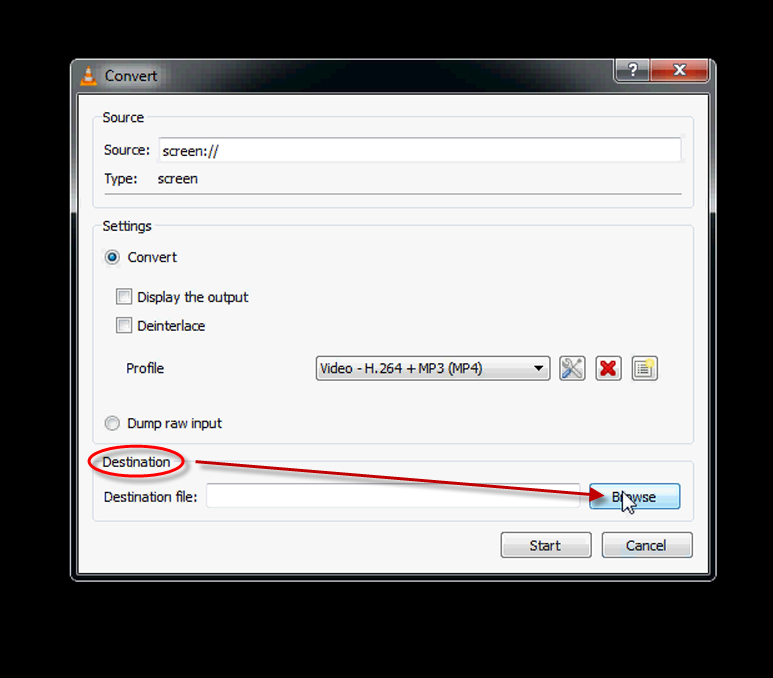

# VLC Screen Capture

VLC is an open source cross-platform media player that can be used to capture a computer screen for a WordCamp presenter that is giving a live demonstration as part of the presentation.

VLC can be downloaded at this [link](http://www.videolan.org/vlc/).

>Be sure to start VLC before the presentation begins so you will be able to capture ALL the presentation – capturing the slides as well as the live demonstration.

>The slides will be cut out of the screen capture recording and the live demonstration will be edited into the actual presentation video.

After installing VLC click the icon VLC to open the program.

To use the screen capture feature Click Media on the Toolbar
and select Open Capture Device …

Which opens a popup box.
Under the Capture Device tab set the Capture Mode to Desktop.

Now set the Desired Frame Rate For the Capture (f/s) from 1 to 30.

Next at the bottom of the pop up under Play select Convert.

Now choose a Destination to save the recorded screen.
Click the Browse button.

and select the destination for the file. Give it a name and click Save.

Make sure the Profile is set to Video – H.264 + MP3 (MP4).

If not then click the Tools icon.

Under Encapsulation select the radio button MP4/MOV and click Save.

Now the screen capture is ready.
Click the Start button and it will record the computer screen.

To Stop the recording click the VLC icon to Close Window.

Locate the recorded file and transfer to a disk or download as instructed.